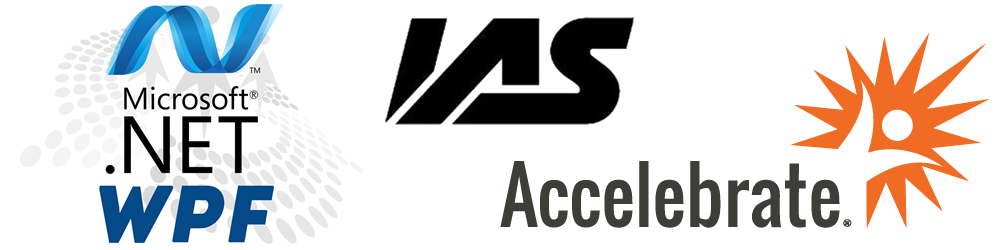

> # **Course Name:  Windows Presentation Foundation**
> ## **Duration:  5 Days**
> ## **Instructor:  Jeff McBride**
> ## **Instructor E-Mail:  jeff@geeklearn.com**
> ## **Prerequisites:  C# and .NET Development Experience**

## **Course Overview**
This training, tailored to IAS Direct’s needs, introduces Web API 2 and related security principles, and then teaches Windows Presentation Framework (WPF) development in depth using Visual C# 2017.

## **Course Topics**

### **Day 1 Topics**

### **Introduction to Web API 2**
* HTTP Protocol
* History of Web Services
* REST Services
* ASP.NET MVC and Web API
* Future of ASP.NET

### **Web API 2** 
* ApiController
* Action Methods and Parameters
* Exceptions
* Configuration
* Routing
* Model Binding
* Formatters
* Status Codes

### **Web API Security**
* Authentication
* Cross-Site Scripting (XSS)
* Cross-Site Request Forgery (CSRF)
* Over-Posting

### **Introduction to WPF** 
* Advantages of WPF
* Resolution Independence and WPF Units
* Planning for a Flexible UI
* Designer Improvements in VS 2017

### **XAML** 
* Declarative Approach to UI Design
* Elements and Attributes
* XAML Namespaces
* Property Elements
* Type Converters
* Markup Extensions
* Collection Items
* BAML and Generated Code
* Code-Behind Files

### **Day 2 Topics**

### **Layout** 
* WPF's Layout Philosophy
* Measure and Arrange Stages
* ScrollViewer Component
* Alignment and Margin
* Border Component
* StackPanel
* WrapPanel
* DockPanel
* Nesting Layout Containers
* Grid and UniformGrid
* GridSplitter
* Canvas

### **Dependency Properties** 
* Change Notification
* Property Value Inheritance
* Defining a Dependency Property
* Registration
* Property Wrappers

### **Event Handling** 
* Understanding Routed Events
* Defining a Routed Event
* Raising an Event
* Direct, Bubbling, and Tunneling events
* RoutedEventArgs
* Drag-and-Drop
* Asynchronous Event Handlers
* Weak Event Patterns

### **Day 3 Topics**

### **Controls** 
* Control Base class
* Content Controls
* Headered Content Controls
* Text Controls
* List Controls
* Range-Based Controls
* Date Controls
* Ribbon Control

### **The Application** 
* Application Events
* Showing a Splash Screen
* Assembly Resources

### **Data Binding** 
* Between Elements
* Binding Modes
* Path and DataContext Properties
* Update Modes
* Input Validation
* New Features in .NET 4.7
* Live Shaping

### **Commands** 
* WPF Command Model
* Bindings, Sources, and Targets
* ICommand Interface
* The Command Library
* Executing Commands
* Disabling Commands
* Custom Commands
* Tracking and Reversing Commands

### **Day 4 Topics**

### **Resources** 
* The Resource Collection
* Static vs. Dynamic Resources
* Non-shared Resources
* System Resources
* Resource Dictionaries
* Sharing Between Assemblies

### **Styles** 
* Style Basics
* Creating a Style
* Attaching Event Handlers
* Style Inheritance
* Typed Styles
* Property-Based Triggers
* Event-Based Triggers

### **Control Templates** 
* Logical and Visual Trees
* Creating Control Templates
* Templates vs. Styles
* Typed Templates
* User-Selected Skins

### **Formatting Bound Data** 
* String Formatting
* Value Converters
* Data Templates
* Data Triggers

### **Day 5 Topics**

### **Multithreading and WPF** 
* WPF Threading Model
* Thread Safety
* The Dispatcher Object
* Using Async and Await

### **Shapes, Brushes, and Transforms** 
* Shape Class
* Sizing and Placing Shapes
* Viewbox Component
* Line, Polyline, and Polygon
* Brushes
* Transforms
* Render vs. Layout Transforms
* Transparency

### **Geometries and Drawing** 
* Path Class
* Curves and Lines
* Clipping

### **Model-View-ViewModel (MVVM)**
* Definition and Evolution of the Pattern
* Building Effective ViewModel Objects
* Leveraging Bindings and Commands
* Minimizing Code-Behind Files
* Data Validation and Handling Errors
* Building Unit Tests and TDD
